- [1. Discussion about the case](#1-discussion-about-the-case)
  - [1.1 : Case Overview](#11--case-overview)
  - [1.2 : Interpreted Context](#12--interpreted-context)
  - [1.3 : High-level goal of the task](#13--high-level-goal-of-the-task)
  - [1.4 : Desired Solution Properties](#14--desired-solution-properties)
  - [1.5 : Evaluation criteria](#15--evaluation-criteria)
- [2. Technical Design](#2-technical-design)
  - [2.1 : Technologies used](#21--technologies-used)
    - [**2.1.1 : Github**](#211--github)
    - [**2.1.2 : ALTO OpenStack**](#212--alto-openstack)
    - [**2.1.3 : Prometheus and Grafana**](#213--prometheus-and-grafana)
      - [**Setting up Prometheus and Grafana**](#setting-up-prometheus-and-grafana)
      - [**Add an Exporter to Prometheus**](#add-an-exporter-to-prometheus)
    - [**2.1.4 : Python**](#214--python)
  - [2.2 : Autoscaling](#22--autoscaling)
      - [**What Is Autoscaling?**](#what-is-autoscaling)
      - [**Why Autoscaling is Needed?**](#why-autoscaling-is-needed)
      - [**Different Ways to Implement Autoscaling:**](#different-ways-to-implement-autoscaling)
      - [**Types of autoscaling :**](#types-of-autoscaling-)
      - [**Use cases for Autoscaling :**](#use-cases-for-autoscaling-)
      - [**Challenges Associated with Autoscaling:**](#challenges-associated-with-autoscaling)
  - [2.3 : Design Overview](#23--design-overview)
    - [**Architecture**](#architecture)
    - [**Monitoring and Data Collection**](#monitoring-and-data-collection)
    - [**Decision Engine**](#decision-engine)
  - [2.4 : Testing Environment and Workflow](#24--testing-environment-and-workflow)
  - [2.5 : Motivation for the Design](#25--motivation-for-the-design)
      - [**Future Enhancements**](#future-enhancements)
- [3. Pilot Implementation](#3-pilot-implementation)
  - [3.1 : Implementation Overview](#31--implementation-overview)
  - [3.2 : Python-Based Decision Engine](#32--python-based-decision-engine)
  - [3.3 : Testing](#33--testing)
  - [3.4 : Key Takeaways](#34--key-takeaways)
  - [3.5 : Future Steps](#35--future-steps)
- [4. Evaluation](#4-evaluation)
- [5. Conclusion](#5-conclusion)
- [Appendix](#appendix)

# 1. Discussion about the case

## 1.1 : Case Overview


Ruby Acorn, a new gaming company with many exciting and popular online games, is facing a challenge with scaling their gaming service to meet the fluctuating demands of their players. Currently, they are using a fixed number of server instances per game, which is causing performance issues and long wait times for players when the number of players is high. And, having too many server instances drives up the cost unnecessarily.

The ideal solution would be to dynamically adjust the number of server instances based on the real-time number of players. This would ensure that players have a consistently good gaming experience while minimizing costs.

## 1.2 : Interpreted Context


The challenge at hand is a recurring issue faced by modern companies that rely on dynamic cloud-based infrastructures. The pattern of aligning resources with demand is a well-known problem in the field of cloud computing and operations. In many cases, it is often referred to as "autoscaling," and it is a fundamental concern for any service provider aiming to deliver a seamless experience to customers while optimizing operational costs.

The case of Ruby Acorn aligns with this broader context. It is a representative example of the common struggle that companies face when balancing the allocation of cloud resources with varying demand. Successful resolution of this challenge has the potential to enhance the overall gaming experience for Ruby Acorn's customers while simultaneously minimizing unnecessary operational expenses.

## 1.3 : High-level goal of the task

The high-level goal of this task is to develop and evaluate an automated solution for scaling Ruby Acorn's gaming service based on the current number of players. This approach represents a more dynamic and reactive solution compared to traditional methods such as manual intervention or time-based adjustments. The solution should be able to accurately predict the required number of instances, react quickly to changes in player count, and minimize costs while maintaining a good gaming experience.

At the end of this report, We would like to answer below questions:
1. How much money could be saved compared to a fixed number of instances?  
**Cost Optimization:** To determine how much money can be saved by automating the scaling of server instances based on player demand compared to a fixed number of instances.

1. How well would such a solution react to any changes in player numbers?  
**Responsiveness:** To evaluate how well the proposed solution reacts to fluctuations in the number of players, accounting for external factors like viral game popularity, events, or the influence of content creators.

1. What would be a good way to measure a "successful 24 hours" using automated scaling?  
**Performance Metrics:** To establish a set of performance metrics and key performance indicators (KPIs) to measure the success of 24-hour periods using the automated scaling solution.


## 1.4 : Desired Solution Properties

The automated scaling solution should have the following properties:

* Accuracy: The solution should accurately predict the required number of server instances based on the current number of players.

* Responsiveness: The solution should react quickly to changes in player count, ensuring that the number of instances is always adjusted to meet the demand.

* Cost-efficiency: The solution should minimize the overall cost of running the gaming service by avoiding both under-provisioning and over-provisioning of server instances.

* Minimal manual intervention: The solution should be as automated as possible, requiring minimal manual intervention to maintain and operate.

* Scalability: The solution should be able to handle a large number of games and players, and should be scalable to accommodate future growth.

## 1.5 : Evaluation criteria

The evaluation of the automated scaling solution within Project Ruby Acorn will be based on several key criteria, which will show how the system performs in many different ways and its impact on the overall gaming infrastructure. The criteria are outlined as follows:

**Accuracy of Predictions:**

The success of the automated scaling solution will be judged by its ability to accurately predict the required number of server instances based on fluctuating player counts. The system's ability in forecasting player demand and dynamically adjusting resources to match it, will be a crucial factor in determining its effectiveness.


**Response Time to Player Count Changes:**

An essential metric for evaluating the solution's performance is the speed at which it responds to changes in player count. A good automatic scaling system should quickly adjust its size to handle changes in how many players are active, scaling up or down as needed. This criterion directly affect the overall gaming experience by ensuring optimal server capacity in real-time.


**Cost Savings:**

The financial impact of the automated scaling solution will be a key factor. The evaluation will assess how well the system achieves cost savings compared to a static number of server instances. This means checking how well the scaling actions can save money when fewer players are active and use resources efficiently when a lot of players are online.


**Ease of Use:**

It's important for the automated scaling solution to be easy to set up, keep up, and use. A good solution should be simple for users and not need a lot of manual work. When we assess it, we'll look at how easy it is to set up, watch over, and manage. Having a system that's easy to understand makes everything work better.

**Scalability:**

For the automated scaling solution to work well in the overall Ruby Acorn gaming world, it's important that it can handle many games and players. Scalability is about checking how good the system is at handling the challenges that come with lots of games and different types of players. A good solution should show that it can handle growth and changing needs really well.

These properties will be helpful in assessing the viability of the autoscaling solution, and their realization will evaluate the success of the project.

# 2. Technical Design

## 2.1 : Technologies used  
Commencing the project, I started by fetching in metrics data from the link: `acit-game-metrics.cs.oslomet.no/metrics`.  
To make sure Project Ruby Acorn achieve its goals, I made use of below technologies that play a key role in building a working solution:

### **2.1.1 : Github**
- **Creating Github Account:**  I started by visiting to the Github website at ``https://github.com/``. Once there, I clicked on the ``Sign in/Register`` button, opting for the option to register for a new account and then successfully logged in with my Oslomet email and the password I had chosen.

- **Checking for an Existing SSH Key:** I opened the terminal and ran:
  ```bash
  cd
  ls -al ~/.ssh
  ```
   I scanned the list for files with extensions ``id_rsa.pub`` and ``id_rsa``. This step determined whether I already had an SSH key in place.

- **Generating an SSH Key:** On my MAC, I opened the terminal and ran [1]: 
  ```bash
  ssh-keygen
  ```
  After pressing Enter, my key pair was ready for use.I navigated to Settings -> SSH keys and I copied the contents of the newly generated ``id_rsa.pub`` file and added it to Github.

### **2.1.2 : ALTO OpenStack**
ALTO OpenStack Cloud provides the infrastructure for technical projects like Ruby Acorn, especially for students like us, engaged in cloud automation and scripting. Accessing virtual machines involves utilizing floating IPs and configuring the Security Group firewall [1].

**Uploading Public Key to ALTO Cloud**   
I identified the public key associated with my system. The public key is one of the two keys in the ``.ssh directory``.
  ```bash
  cat .ssh/id_rsa.pub
  ```
  I visited the ALTO Cloud Interface in my web browser and navigated to the "Compute" section and located and clicked on "Access & Security". By choosing the "Key Pairs" section, I initiated the key import process by clicking on "Import Key Pair." Then I pasted the entire content of the public key from my clipboard and the verification of the successful upload of my key was done. 

**Creating the First ALTO Instance**   
**Step 1:** Launch an Instance

  Navigate to the ALTO web interface and select "Compute" -> "Overview" -> "Instances." Click "Launch Instance." Choose the appropriate options, focusing on flavor (e.g., C2R4_10G), image (e.g., Ubuntu 22.04), and key pair. Leave the "Create New Volume" option to yes under the "Source" section and set a suitable volume size (e.g., 20G).

  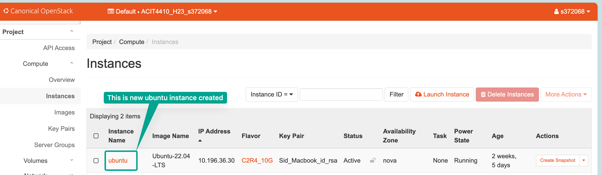

  **Step 2:** Allow SSH Access

  Return to the ALTO web interface, go to Project -> Access & Security -> Security Groups. Manage rules on the "default" ruleset, click "Add Rule," and set "22" as the port range to enable SSH access from the outside.  

  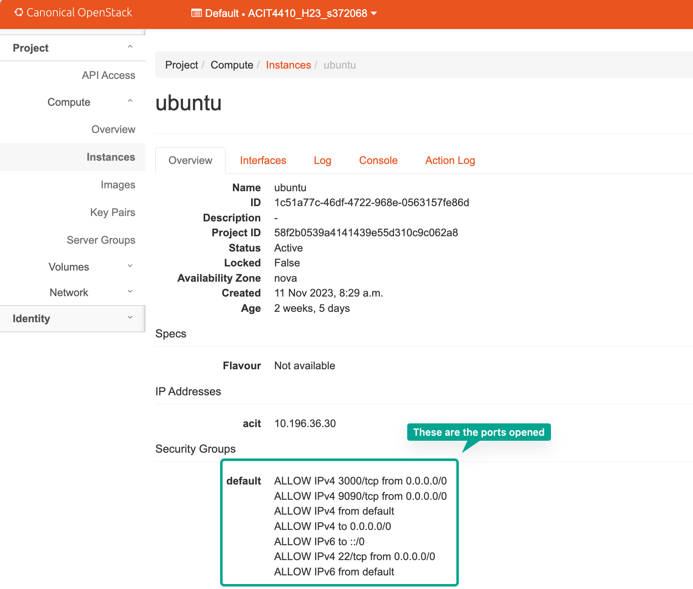


###  **2.1.3 : Prometheus and Grafana**

Prometheus is an open-source monitoring and alerting toolkit designed for reliability and scalability in modern, dynamic environments. It is particularly well-suited for monitoring containerized applications and microservices architectures. Prometheus employs a pull-based model, where it scrapes metrics from instrumented targets at regular intervals.

Grafana complements Prometheus by providing a powerful visualization platform. It allows the creation of interactive and customizable dashboards, turning raw metrics data into insightful, aesthetically pleasing visual representations. In the context of Ruby Acorn, Grafana's dashboards will offer a real-time overview of the gaming service's performance, player engagement metrics, and the health of individual servers. 

- Prometheus and Grafana will offer real-time visibility into our Ruby Acorn's performance and infrastructure metrics. This is crucial for identifying bottlenecks, anomalies, or potential issues before they impact the player experience.
- Prometheus enables autoscaling by providing insights into resource usage, allowing the gaming service to dynamically scale up or down based on demand, ensuring optimal performance during peak times.
- Grafana's visualization capabilities will allow us to create custom dashboards to monitor player engagement metrics. This data will be used to enhance the overall gaming experience, understand player behavior, and make informed decisions to optimize game performance.
- The combination of Prometheus and Grafana will help us to make informed decisions regarding infrastructure improvements, game updates, and future development, aligning the gaming service with player expectations.

#### **Setting up Prometheus and Grafana**

**Step 1:** Downloading Prometheus Stack
This is started by cloning the Prometheus stack from GitHub:

```bash
git clone https://github.com/vegasbrianc/prometheus
cd prometheus
```
**Step 2:** Exploring the Configs
Navigating into the repository and inspecting the files:
```bash
nano docker-stack.yml
```
Before deploying, the default Grafana dashboard password was modified:
```bash
nano grafana/config.monitoring
```
**Step 3:** Starting the Entire Stack
The stack deployment is initiated with:
```bash
docker stack deploy -c docker-stack.yml prom
docker service ls
```
**Step 4:** Connecting to the User Interface and Checking Status
Access the Grafana dashboard on port 3000:

I ensured port 3000 is open in Access and Security. Then I Logged in with the default username "admin" and the newly set password [1]. 

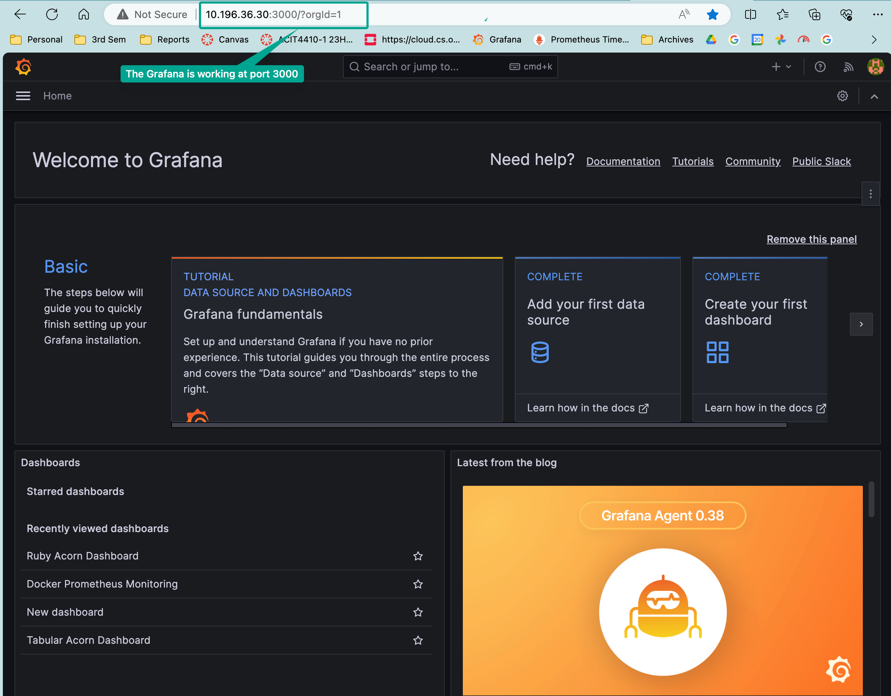

#### **Add an Exporter to Prometheus**

While Grafana serves as the graphical front-end for data display, Prometheus, as the underlying system, excels at collecting and storing time-series data. Rather than servers sending updates directly, Prometheus relies on exporters, tiny web pages running on servers, to collect data at regular intervals. These servers, referred to as targets, become part of Prometheus's scraping process. This scraping action provides real-time snapshots of the servers' current states.

**Step 1:** Navigating to the "prometheus" folder within the Git repository and accessing the "prometheus" subfolder.
```bash
cd prometheus/prometheus
```
**Step 2:** Safeguarding the configuration file by creating a backup.
```bash
cp prometheus.yml prometheus.yml.backup
```
Opening the configuration file for editing.
```bash
nano prometheus.yml
```
**Step 3:** Adding a new target configuration under "scrape_configs" in the YAML file. Ensuring proper indentation.

```yaml
  - job_name: 'games'
    scrape_interval: 60s
    static_configs:
         - targets: ['10.196.36.11:80']
```

**Step 4:** Restarting the Prometheus stack by going back to the main repository folder, removing the stack, and deploying it again.

```bash
docker stack rm prom
docker stack deploy -c docker-stack.yml prom
``````
Verifying the successful deployment:
```bash
docker service ls
docker service ps prom_prometheus
```
**Step 5:** Then I added a panel in Grafana to visualize the new data [1]. Created a new dashboard, added an empty panel, and configured the panel settings. Used PromQL query patterns to fetch data from Prometheus. In this case, I took the metric as "player_count" for the game "PLAYERUNKNOWNS BATTLEGROUNDS". Below is the screenshot:

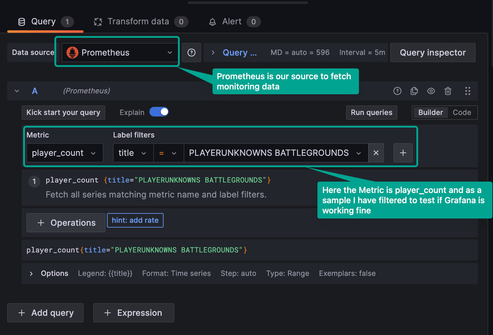

The completed setup now offered a dynamic dashboard in Grafana displaying the player count data fetched from the newly added target in Prometheus [1].

As a starting point I had  taken four games, so that i can get overview about the player count (across hours each day, for 7 days) of these sample games, below is the snapshot:

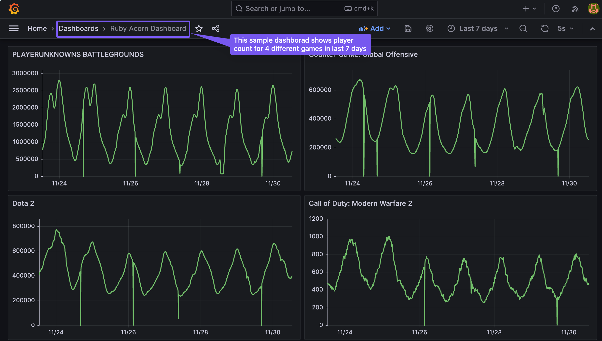

Later on all the games were monitored in a tabular form.

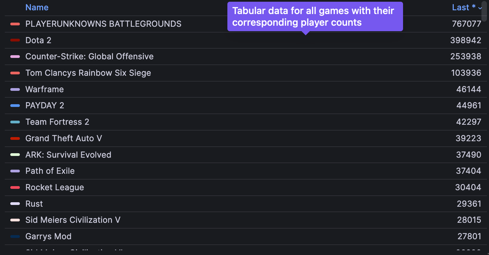

###  **2.1.4 : Python**
Python was chosen as the primary programming language for developing the decision engine that will power the Autoscaling logic for the Ruby Acorn Project. Python's robust libraries and its versatility in handling complex data processing tasks make it an ideal choice for this project.

## 2.2 : Autoscaling
#### **What Is Autoscaling?**

Autoscaling is a scaling technique you can apply to workloads hosted in a cloud environment. One of the major benefits of cloud-based hosting is that you can readily scale capacity to whatever extent is needed to support the demand for your service. Autoscaling takes that advantage a step further. With autoscaling, as the demand for a given workload changes over time, the amount of resources allocated to support that workload adapts automatically to meet your performance requirements [2].

Before autoscaling was an option, scaling workloads was often challenging. Allocating resources manually to support a workload is inherently error-prone because it is difficult to precisely predict changes in demand or know how many resources are needed to handle those changes. This ambiguity can lead to costly over-provisioning on the one hand, or potential service disruptions due to under-provisioning on the other. Autoscaling helps solve these problems by automatically increasing or decreasing the amount of resources assigned to your workload in direct proportion to the amount that demand also increases or decreases.

#### **Why Autoscaling is Needed?**

- **Fluctuating Workloads:** Online gaming services often experience unpredictable spikes in user activity, especially during new game launches, events, or promotions. Autoscaling allows the infrastructure to adapt to these fluctuations, ensuring a seamless user experience.

- **Cost Optimization:** Autoscaling helps in optimizing infrastructure costs by dynamically scaling resources up or down based on demand. This ensures that you only use the necessary resources when needed, preventing over-provisioning during periods of low demand.

- **Enhanced Reliability:** In a gaming environment, maintaining consistent service availability is critical. Autoscaling provides redundancy and fault tolerance, distributing the load across multiple instances. If one server fails or experiences issues, the others can seamlessly take over, minimizing downtime.

- **Improved User Experience:** With autoscaling, you can ensure that your gaming service can handle an increasing number of players without degradation in performance. This leads to a better overall gaming experience, as players encounter minimal lag, quick response times, and uninterrupted gameplay[3].

#### **Different Ways to Implement Autoscaling:**

- **Horizontal Autoscaling:** Also known as scaling out, this approach involves adding or removing instances of the application to the existing infrastructure. In our game, this could mean adding more game servers during peak hours and reducing the count during off-peak periods.

- **Vertical Autoscaling:** Also known as scaling up, this involves adjusting the resources within a single instance, such as increasing CPU, memory, or GPU capacity. This is suitable when a particular game server or component requires additional resources to handle increased demand.

- **Predictive Autoscaling:** This approach involves using historical data and predictive analytics to anticipate future demand. By analyzing patterns and trends, the system can proactively scale resources before a surge in demand occurs, ensuring readiness during peak times.

- **Event-Driven Autoscaling:** Autoscaling can be triggered by specific events, such as a sudden increase in the number of players or a new game release. These events act as signals to dynamically adjust the infrastructure to accommodate the changing conditions.

- **Container Orchestration Autoscaling:** If the gaming service is deployed using containerization (e.g., Docker), container orchestration tools like Kubernetes can automatically scale the number of container instances based on predefined metrics or triggers[3].


#### **Types of autoscaling :**
There are three types of autoscaling:

- **Reactive** : With a reactive autoscaling approach, resources scale up and down as traffic spikes occur. This approach is closely related with real-time monitoring of resources. There is often also a cooldown period involved, which is a set time period where resources stay elevated -- even as traffic drops -- to deal with any additional incremental traffic spikes.
- **Predictive** : In a predictive autoscaling approach, machine learning and artificial intelligence techniques are used to analyze traffic loads and predict when more or fewer resources will be needed.
- **Scheduled** : With a scheduled approach, a user can define a time horizon for when more resources will be added. For example, ahead of a major event or for a peak time period during the day, rather than waiting for the resources to scale up as demand ramps up, they can be pre-provisioned in anticipation[3].

#### **Use cases for Autoscaling :**
- **E-commerce Websites:** During special promotions, sales, or seasonal peaks, e-commerce websites can auto-scale to handle increased traffic and ensure a smooth shopping experience for users.Scaling down during periods of lower activity helps optimize costs when demand decreases.

- **Media Streaming Services:** Streaming platforms experience fluctuating demand based on the time of day, live events, or popular releases. Autoscaling ensures that sufficient resources are available to handle peak streaming loads, preventing buffering and downtime.

- **Online Gaming Platforms:** Multiplayer online games often experience variable user loads, especially during peak gaming hours or major events.Autoscaling helps gaming platforms dynamically adjust server capacity to meet demand, maintaining a seamless gaming experience.

- **Social media platforms:** Social media platforms witness spikes in user activity during trending events or specific times of the day.Autoscaling allows platforms to adapt to changing loads, ensuring responsive and reliable services for users[3].


#### **Challenges Associated with Autoscaling:**
- Configuring autoscaling is often complex in practice
For an application to auto-scale successfully, every component in that application needs to auto-scale, including the frontend, the backend, the database layer, and infrastructure elements such as load balancers.
- The application has to be designed with horizontal scaling in mind. To support horizontal scaling, engineers need to develop the application as a set of microservices. 
- Sudden demand peaks may outpace the autoscaling response.
Even in a best-case scenario, nodes may take minutes to come online while customers are already experiencing poor performance/slowness.
- Effective autoscaling requires engineers to identify the correct performance metrics to trigger scaling. Engineers might auto-scale their infrastructure based on the wrong performance metrics, ultimately resulting in a poor user experience[3].

## 2.3 : Design Overview  

Now, we're planning a technical design for Ruby Acorn's autoscaling solution. It's going to be a detailed and adaptable framework, designed to handle the always-changing nature of online gaming. This design is like a standard or best-case scenario, showing a general layout that includes a lot of different technical parts, as you can see below:

### **Architecture**

The architecture of the autoscaling solution can be summarized with the below flow chart:
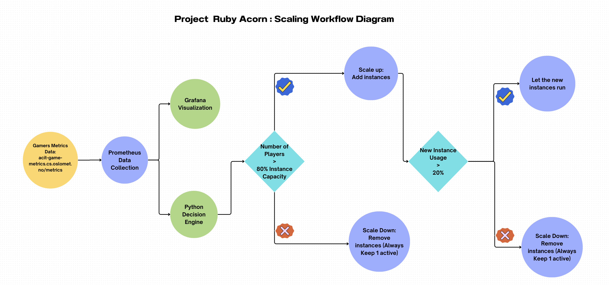

Below is the explanation of all the components in detail:

### **Monitoring and Data Collection**  

To ensure a real-time understanding of player activity, the solution will include a robust monitoring and data collection system. This includes:

* **Prometheus Integration:** We are using Prometheus to collect and store metrics related to Game Title, Player Numbers, game performance, and server resource utilization. Prometheus offers the flexibility to scrape data from various sources and provides a reliable time-series database for storage.

* **Grafana Dashboard:** Grafana will serve as the front-end visualization tool, enabling stakeholders to monitor and analyze game metrics in real-time. This dashboard will offer insights into player engagement, server performance, and autoscaling decisions.

### **Decision Engine**  

The decision engine forms the core of the autoscaling solution. This component will be responsible for analyzing the player data collected by Prometheus and determining the appropriate number of server instances for each game. The decision engine will use a Python code to predict future player demand and adjust the number of instances accordingly.

This component incorporates:

* **Python-Based Engine:** We are using Python based code for its versatility and ease of integration with Prometheus and other data sources. The engine will be hosted in a Git repository, promoting version control and collaborative development.

* **Autoscaler:** For the initial implementation, a straightforward algorithm is deployed. It calculates the required number of instances by dividing the current number of players by the capacity of each server instance. This algorithm is flexible for adjustments and refinements in later stages.The autoscaler will communicate with the cloud provider (OpenStack in our case) to start and stop server instances as needed.

* **Data Retrieval:** The decision engine currently fetches the data directly from Prometheus, it can use more advanced queries when necessary to make informed scaling decisions.


## 2.4 : Testing Environment and Workflow  

To mitigate potential risks and assess the solution's functionality, a controlled testing environment is implemented. This includes:

* **Instance Scaling:** Instead of risking production systems, we are scaling the number of instances on a limited number of servers. We are increasing or decreasing the number of instances on our OpenStack server. This approach offers a safe and cost-effective means of testing the solution's effectiveness.

* **Monitoring and Cost Analysis:** The testing environment will also include monitoring tools to track instances, player load, and associated costs. This data will enable performance evaluation and cost-saving analysis. We are doing a complete 24 hours of testing on a set of games.

Workflow Overview for Automated Scaling in Ruby Acorn's Gaming Service:

1. **Prometheus Data Collection:**
  The workflow initiates with Prometheus, a robust monitoring tool, scraping real-time player data from the game servers. This data, encompassing various metrics and performance indicators, is then stored in a time-series database. Prometheus acts as the primary source for acquiring and managing crucial information regarding player activity.

1. **Game Server Data Transmission:**
  Simultaneously, the game servers actively contribute to the workflow by continually sending player data to Prometheus. This two-way communication ensures that the player-related metrics remain up-to-date and accurate. The seamless integration of game servers into the data collection process lays the foundation for a comprehensive understanding of player behavior and trends.

1. **Grafana Visualization:**
  The collected player data is channeled into Grafana, a powerful visualization platform. Grafana translates raw metrics into insightful and visually engaging dashboards, providing us with a user-friendly interface to monitor and interpret player-related information. These dashboards play a pivotal role in offering a real-time, easy to understand snapshot of the gaming service's performance.

1. **Decision Engine Analysis:**
  The decision engine is an important part of the process. It starts by looking at all the player data combined. Using smart math tricks, it looks at historical patterns and how they are now to predict what players might do next. This predictive analysis helps in making scaling decisions about adjusting the game setup ahead of time, so it's ready for what players might want.

1. **Scaling Decisions Transmission:**
  The decision engine, with its predictive insights, communicates to the autoscaler. It tells the autoscaler whether to scale up or down, the number of instances to be adjusted, and perfect timing to do it. Sending out these instructions is a proactive approach to manage server resources, adjusting the game setup based on what players are doing..

1. **Autoscaler Execution:**
  The final phase of the workflow is executed by the autoscaler, which acts like a manager of server instances. In response to the received scaling decisions, the autoscaler takes appropriate actions, initiating the start or stop processes for server instances. This execution phase ensures that the gaming infrastructure aligns perfectly with the predicted player demand, optimizing performance and cost-effectiveness.

**Key Dynamics:**
   - **Continuous Feedback Loop:** The workflow operates as a continuous feedback loop, Prometheus and game servers keep sending new data all the time, the decision engine keeps getting better at predictions, and the autoscaler dynamically adjusting resources.

   - **Predictive Intelligence:** The decision engine's ability to predict future player demand based on historical and current data brings a forward-looking approach to the workflow, enhancing its adaptability to changing gaming scenarios.

   - **User-Friendly Monitoring:** Grafana's role in visualizing player data ensures that stakeholders, including engineers and decision-makers, can easily interpret the gaming service's performance and scaling dynamics through intuitive dashboards.

This well-structured workflow integrates data gathering, predictive analysis, and automated scaling, creating the base for Ruby Acorn's aim to enhance their gaming service for both players and operational efficiency.

## 2.5 : Motivation for the Design

1. **Scalability:**
- **Challenge Addressed:** Accommodating a Diverse Gaming prospect
 - **Motivation:** Ruby Acorn has a vision of a dynamic gaming ecosystem with many games and a diverse player base. The design gives preference to scalability to seamlessly integrate a growing scenario of games and efficiently handle the increasing number of players. This ensures that the infrastructure can adapt to the changing demands of the gaming prospect without compromising performance.


2. **Accuracy:**
- **Challenge Addressed:** Predicting Player Demand with Precision
 - **Motivation:** The heart of the system lies in the accuracy of predicting future player demand. To enhance the gaming experience and optimize resource allocation, the decision engine is thoroughly designed to analyze historical and real-time data. By sticking to this principle, Ruby Acorn aims to provide precise scaling decisions, ensuring that server instances are dynamically adjusted in accordance of actual player needs.

3. **Responsiveness:**
- **Challenge Addressed:** Real-time Adaptability to Player Count Fluctuations
 - **Motivation:** In the fast-paced world of online gaming, player counts can change rapidly. The system prioritizes responsiveness to smoothly adapt to these changes. By promptly scaling up or down in response to varying player activity, Ruby Acorn aims to maintain an optimal player experience, preventing performance hinderance during peaks and minimizing resource waste during break period.

4. **Cost-efficiency:**
- **Challenge Addressed:** Minimizing Operational Costs
 - **Motivation:** Operating a gaming service involves substantial costs, and Ruby Acorn is committed to optimizing these expenses. The design focuses on cost-efficiency by dynamically adjusting the number of server instances. Scaling decisions are driven by the need to balance performance with resource utilization, ensuring that the gaming service operates at the lowest overall cost without compromising player satisfaction.

5. **Ease of Use:**
- **Challenge Addressed:** User-Friendly Operation and Maintenance
 - **Motivation:** Understanding the importance of operational simplicity, the design prioritizes ease of use. Setting up, maintaining, and operating the system should not be a difficult task. By implementing an automatic and user-friendly interface, Ruby Acorn aims to empower administrators, engineers, and operators, making the management of the automated scaling system straightforward and efficient.

**Integrated Approach:**  
  The combination of these design principles forms a cohesive approach to building an automated scaling system that not only addresses the specific challenges faced by Ruby Acorn but also aligns with their extensive goals of delivering a scalable, accurate, responsive, cost-efficient, and user-friendly gaming service.

**Continuous Improvement:**  
  The design principles serve as guiding pillars for the initial implementation, with a commitment to ongoing improvement. As the gaming landscape evolves and technology advances, Ruby Acorn will continually evaluate and enhance the system to maintain its effectiveness and relevance in a dynamic gaming industry.


#### **Future Enhancements**

The proposed system can be further enhanced by incorporating the following features:

* **Real-time prediction:** The decision engine could use real-time data, such as player logins and game events, to make more accurate predictions of future player demand.

* **Anomaly detection:** The system could be extended to detect anomalies in player behavior, such as sudden spikes in player count, and take appropriate actions.

* **Game-specific scaling:** The system could be configured to use different scaling algorithms for different games, based on their unique usage patterns.

# 3. Pilot Implementation

In this section, we will present the practical implementation of the pilot project based on the technical design outlined in the previous section. The pilot implementation closely follows the proposed design, with certain timesaving plans which is required by the project's scope and priorities. We will provide a concise and focused overview of the critical technical details, including configuration files, code snippets, and screenshots.

## 3.1 : Implementation Overview


**Prometheus Integration:**  
To implement the monitoring and data collection component, we have integrated Prometheus into the Ruby Acorn infrastructure. Prometheus serves as a powerful tool for gathering metrics related to player numbers, server performance, and resource utilization.

Below is a snippet of the Prometheus configuration file highlighting key parameters: 
```yml
  - job_name: 'games'

    # Scrape targets from this job every 60 seconds.
    scrape_interval: 60s

    static_configs:
      - targets: ['10.196.36.11:80']
```
The code shows how we are fetching the data from the source dataset available at `10.196.36.11:80` or `acit-game-metrics.cs.oslomet.no/metrics`

Below is how the Prometheus setup looks like at `http://10.196.36.126:9090/targets?search=games`:

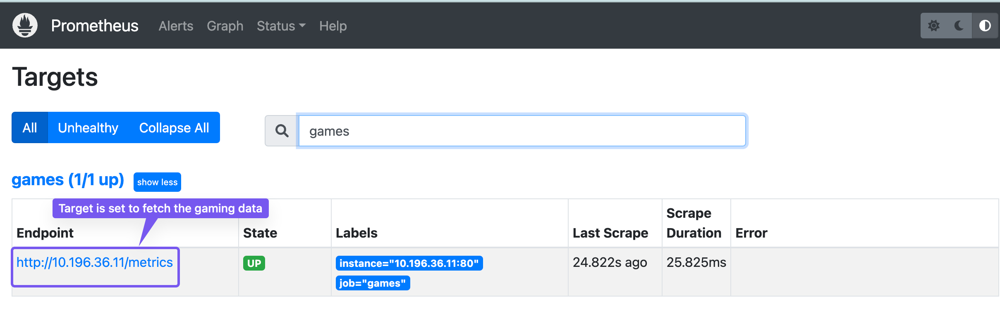

This shows that we have configured Prometheus to fetch the player data for each title from the source and it is actively scrapping the data.

**Grafana Dashboard:**  
Once the Prometheus configuration was completed, we made a dashboard in Grafana to visualize the data. Below is the sample screenshot how the Grafana dashboard looks:

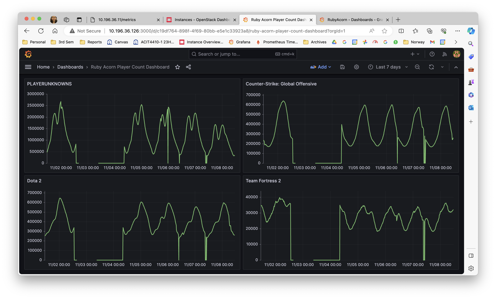
The above image shows that the Grafana dashboard is up and running and can show the Game Titles and Number of Players. 

## 3.2 : Python-Based Decision Engine

The decision engine forms the heart of the autoscaling solution, continuously evaluating player load and adjusting the instance numbers to make scaling decisions.

The decision engine has been implemented in Python, hosted in a Git repository for version control and collaborative development. Code snippets from the repository are provided for clarity.

Github Location:  (`https://github.com/PratimaAI/agile-project-acit4410`)

**Detailed explanation of the decision engine of Ruby Acorn:**  

**1. Environment Setup:**
 ```python
from prometheus_api_client import PrometheusConnect
from openstack import connection
import time
import os
from dotenv import load_dotenv, dotenv_values

load_dotenv()
```
The script starts by importing necessary libraries. The `PrometheusConnect` library is used for interacting with Prometheus, and the `connection` module from the openstack library is employed for communication with the OpenStack infrastructure. The `dotenv` module is used to load environment variables from a .env file. 

**2. OpenStack and Prometheus Configuration:**
```python
auth_url = 'https://cloud.cs.oslomet.no:5000/v3'
project_name = os.getenv("ALTO_PROJECT_NAME")
username = os.getenv("ALTO_USERNAME")
password = os.getenv("ALTO_PASSWORD")

prometheus_url = 'http://10.196.36.30:9090/'
```
Username and password for the configuration are not hard coded, rather are saved in a separate `.env` file. It is very important that this `.env` file should not be uploaded to the Github, as it can expose the credentials. So, in order to avoid the credential exposure, we have created a `.gitignore` file and mentioned all the file extensions which should not be uploaded to Github.

**3. Prometheus Initialization:**
```python
prom = PrometheusConnect(url=prometheus_url)
```

A connection to Prometheus is initialized using the specified URL.

**4. OpenStack Connection Initialization:**
```python
conn = connection.Connection(auth_url=auth_url,
                    project_name=project_name,
                    username=username,
                    password=password,
                    project_domain_id='default',
                    user_domain_id='default')

```
A connection to the OpenStack cloud is initialized using the provided configuration details.

**5. Functions to create instances and delete instances:**

```python
def create_instance():
    # Define the instance details
    instance_name = 'new-instance'
    image_name = 'Ubuntu-22.04-LTS'  
    flavor_name = 'C2R4_10G'
    network_name = 'acit'

    # Find the image and flavor
    image = conn.compute.find_image(image_name)  
    flavor = conn.compute.find_flavor(flavor_name)

    # Find the network by name
    network = conn.network.find_network(network_name)

    # Create the instance and specify the network
    server = conn.compute.create_server(name=instance_name,
              image_id=image.id,
              flavor_id=flavor.id,
              networks=[{"uuid": network.id}])

    return server


def delete_instance(instance_id):
    # Delete the instance
    conn.compute.delete_server(instance_id, ignore_missing=False)


```
**6. Main function**
In the main function we have defined the logic to autoscale the instances based on the number of players. 

I've incorporated an 80-20 rule for autoscaling, where if an instance surpasses 80% capacity utilization, it initiates a scale-up event, launching a new instance. Conversely, if a newly launched instance falls below 20% utilization, a scale-down event is triggered, leading to the deletion of the least utilized instance. Moreover, the autoscaling solution guarantees the presence of at least one instance running continuously. This approach optimally manages resources by dynamically adapting the instance count according to the real-time player count. The solution checks for number of players every 5 minutes.

## 3.3 : Testing

The goal of the testing environment was to mimic real-world conditions and assess the solution's performance without affecting live systems. One of the first challenges was to identify the appropriate games for analysis and testing. Due to the vast number of games included in the metric data, I needed to filter them down to a manageable subset.

To accomplish this, I applied the criteria which involved selecting games based on their degree of variation over the past 15 days and the fluctuation in player activity. Games that experienced significant changes throughout the day were also considered. While some games had a very small player base, ranging from one to ten or a hundred, I decided to focus on games with a larger and more dynamic player count. This choice aimed to thoroughly test the scaling mechanism's ability to handle both large and small fluctuations in player numbers. 

Nonetheless, after testing the games with larger player count, I also tested a few games with lower player counts to ensure the mechanism's effectiveness across the spectrum.

The table below lists four sample games that exhibited notable changes in player count over time.<<>>

**Scaling:**  
In the testing phase, we have scaled the number of instances on our OpenStack server to emulate real-world conditions. Screenshots of Docker scaling commands and monitoring tools are provided for illustration. 

This is the instance situation before the autoscale is enabled in our OpenStack cloud:

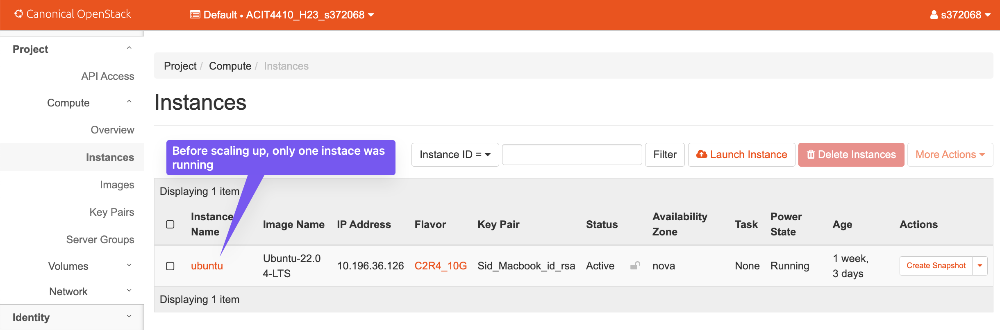  

Now, once the decision engine is triggered, the output of the python code can be seen informing about the number of players and numbers of instance needed. 

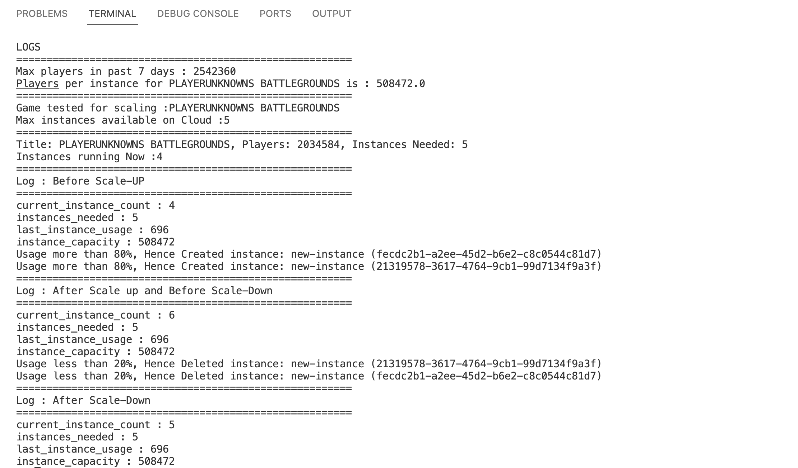
Once the decision engine checks if the number of the instances required is less than the number of instances actually running, it scales up and starts new instances in the Openstack. Below is the image which shows that when 4 instances were needed by this test game, then ***+3 instances*** were triggered and the scalability is achieved.

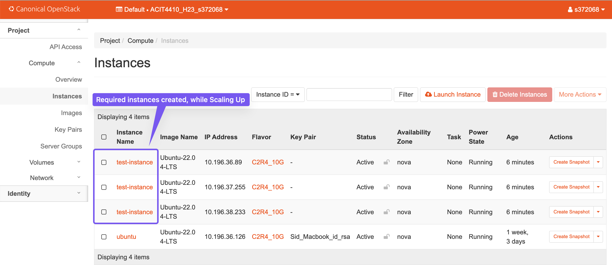

Also, the scaling down feature was also tested, when the number of instance needed is less than the running instances, we can scale down and delete the latest started instance, so that cost can be saved and the gamers can also have a good playing experience. Below is the screenshot for scaling down situation:

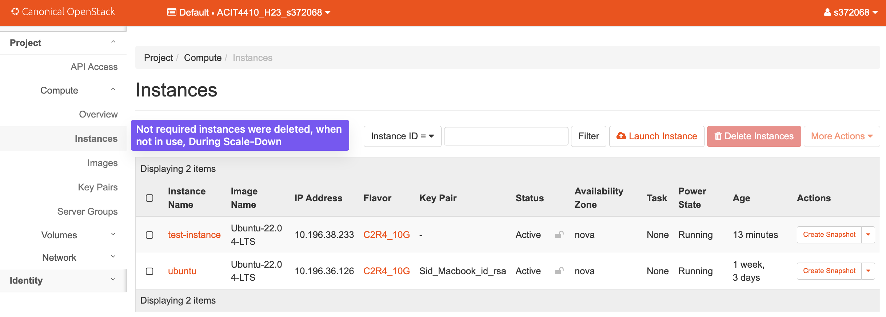

## 3.4 : Key Takeaways

The pilot implementation serves as an initial step toward realizing the autoscaling solution at Ruby Acorn. While pragmatic shortcuts were taken, the core components, including monitoring, the decision engine, and the testing environment, have been successfully established. This pilot provides a foundation for further development, testing, and refinement in line with the project's objectives.

During the pilot implementation, the following lessons were learned:
- The accuracy of the python algorithm is highly dependent on the quality of the historical data.
- The system is sensitive to changes in the python algorithm.
- The system requires careful monitoring to ensure that it is operating as expected.

## 3.5 : Future Steps

The next steps for this project are:
- To improve the accuracy of the python algorithm by using more historical data. 
- Implementing additional features, such as real-time prediction and anomaly detection. 
- Deploying the system to production and monitor its performance.
<br></br>


# 4. Evaluation

To begin the evaluation of the automated scaling solution for Ruby Acorn's gaming service, we'll focus on addressing the key questions outlined by the CIO.   
By systematically addressing these questions, our evaluation will provide valuable insights into the functionality, cost-effectiveness, and adaptability of the automated scaling solution, aiding the CIO in making informed decisions about its future implementation.

**1 . How much money could be saved compared to a fixed number of instances?**

To understand potential cost savings, let's consider a hypothetical scenario. Suppose Ruby Acorn currently maintains a fixed number of instances 5 for each game, regardless of the actual number of players. During peak times, they may have excess capacity, while during low periods, they are still paying for unused instances.

Now lets consider the below Game-specific Data:

Game Name: PLAYERUNKNOWNS BATTLEGROUNDS  
Maximum Players (30-day data) : Approx 2,500,000  
Minimum Players (30-day data) : Approx 50,000

Now if we consider below assumptions:
- The fixed instances cost to be $1 per instance, per hour.
- The autoscaling strategy scales up when one instance is used more than 80% of its capacity and scales down when one instance is used less than 20% of its capacity. And at least one instance will always be running.

Potential Savings with Scaling:

- Implementing automated scaling could dynamically adjust the number of instances based on player load.
- During peak hours, automatically scale up instances to accommodate more players.
- During off-peak hours, scale down instances to minimize costs.

During peak hours (2,500,000 players), all 5 instances are assumed to be required.
During off-peak hours (50,000 players), only 1 instance is assumed to be required.

The maximum number of players that can be served by one instance is 500,000. At 80% capacity, one instance can serve 400,000 players. At 20% capacity, one instance can serve 100,000 players. 
If the number of players for this game is between 50,000 and 400,000, then only one instance will be needed. If the number of players is between 400,000 and 800,000, then two instances will be needed. If the number of players is between 800,000 and 1.2 million, then three instances will be needed, and so on.

If we assume that the average number of players for the game is 1,500,000, then 3 or 4 instances will run on the average day, then the following calculation shows the potential savings with autoscaling:

Cost of 5 instances(24 hours): Fixed Cost = $1/instance/hour × 5 instances × 24 hours .
Which gives us $120 for 1 day

Cost with Autoscaling , 3 instances (24 hours) = $1/instance/hour×3 instance×24 hours 
which gives us $72 for 1 day

Saving per day is between $24 to $48 and per year is between $8,760 to $17,520 (if the instances varies between 3 and 4 on a normal given day for a game).

Below is the spreadsheet screenshot  which compares the cost and the potential savings in case of scaling and static instances.

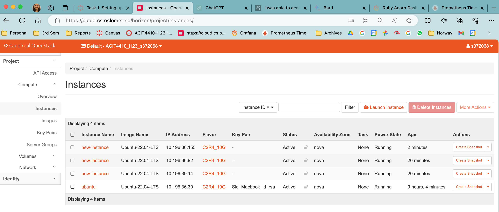

The savings per year are calculated based on the assumption games being played 365 days in a year, also these figures can vary based on number of players, hence Potential Savings is shown between $17,520-$35,040 a year.  

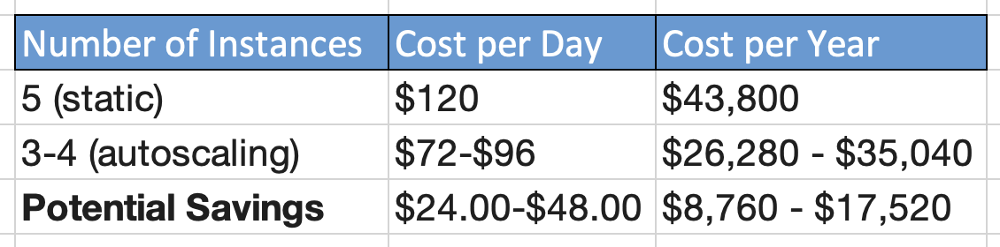  

<br></br>

Autoscaling can save Ruby Acorn a significant amount of money on their cloud computing costs for the game "PLAYERUNKNOWNS BATTLEGROUNDS". 
In addition to the financial savings, autoscaling can also improve the player experience for the game. By ensuring that the game is always running at a comfortable capacity, autoscaling can help to reduce lag and improve performance. This can lead to happier players and a more successful game. This autoscaling ensures that Ruby Acorn is not overpaying for unnecessary instances during quiet periods and can efficiently handle the massive player influx during peak times, optimizing both cost and player experience.

The logic here is that during off-peak hours, having a fixed number of instances may lead to unused capacity and unnecessary costs. On the other hand, during peak hours, fixed instances might not be sufficient, leading to performance issues. By dynamically adjusting the number of instances based on player load, automated scaling can optimize costs by using the minimum necessary instances during low activity and scaling up during peak times, avoiding both under-provisioning and over-provisioning.

- Responsiveness without Scaling: Performance suffers due to insufficient instances, leading to poor player experience. Excess capacity results in unnecessary costs during low activity.

- Responsiveness with Automated Scaling: Automated scaling quickly detects the surge and dynamically adds instances to handle the increased load. Instances are scaled down promptly to optimize costs during low activity.

This analysis lays the groundwork for a cost-effective and responsive infrastructure that aligns with Ruby Acorn's goals of providing an exceptional gaming experience while maintaining financial prudence.

**2 . How well would such a solution react to any changes in player numbers?**

For autoscaling, I have implemented the 80-20 logic, which means that when an instance is utilized more than 80% of its capacity, a scale-up event is triggered, and a new instance is launched. Similarly, when a new instance is utilized less than 20%, a scale-down event is triggered, and the latest instance is shut down. Additionally, the autoscaling solution ensures that at least one instance is running at all times. This logic helps in efficiently utilizing resources and dynamically adjusting the number of instances based on the actual player count.

But it is important to note that there will be some lag between the time that the player numbers change and the time that the autoscaling solution reacts. This is because the autoscaling solution needs to collect data on the number of players for a game at regular intervals before it can make a decision about whether or not to scale up or down the number of instances. 

The following is a mathematical analysis of how an autoscaling solution with an 80-20 logic would react to changes in player numbers:

In my testing, The system collects data on the number of players for a game at regular intervals, for testing I have kept it at every 5 minutes interval. The system scales up and down every 5 minutes (depending upon the number of players). The autoscaling strategy scales up when one instance is used more than 80% of its capacity and scales down when the last triggered instance is used less than 20% of its capacity.


**Scenario 1:  When Scale up should happen**   

Assuming that a single cloud instance can effectively manage a player load of up to 500,000 for the game 'PLAYERUNKNOWNS BATTLEGROUNDS.'During our testing, it was observed that at the beginning of the day, the number of players for this game gradually increased from approximately 5,000 to a peak of 400,000 players.

Once the first running instance reaches 80% capacity, the decision engine automatically triggers a system scale-up. A new instance is added, resulting in two instances operating simultaneously with a combined capacity of handling up to 1,000,000 players within the next five minutes.


**Scenario 2: When neither scale up, nor scale down should happen**  

As the day progressed, the player count for the game increased to 1,200,000. Given that this number surpassed the capacity of two instances, the decision engine triggered a third instance. Now, with a total of three instances in operation, the system can handle up to 1,500,000 players.

For several hours, we closely monitored the player count, and it consistently remained well within the capacity of the three instances. During this period, the game operated smoothly without any instances scaling up or down. The decision engine effectively determined that three instances were optimal for meeting the demand, ensuring a stable and efficient gaming experience.


**Scenario 3: When scale down should happen**  

Once again, the player count decreased to 750,000. Our decision engine assessed that this reduced number of players could be efficiently handled with fewer instances. Consequently, instead of three instances, the decision engine determined to scale down the system. The latest instance was terminated, leaving two instances operational. All players were seamlessly accommodated by the remaining two instances without any lag, ensuring the game continued to function smoothly. The scale-down operation was successfully executed and tested.

**Scenario 4: When both scale up and scale down should happen**  

As the number of players increased from 750,000 to 810,000, the decision engine triggered a new instance. Since the last instance was being utilized more than 80%, the decision engine initiated the addition of a new instance, bringing the total number of running instances to three.

Every five minutes, the decision engine re-evaluated whether the most recently triggered instance was being utilized more than 20%. During our testing, we observed fluctuations in the player count, ranging from 750,000 to 790,000 for a few minutes. This prompted the decision engine to execute the scale-down functionality, terminating the additional running instance and reducing the number of instances to 2.


**3 . What would be a good way to measure a "successful 24 hours" using automated scaling?**

A good way to measure a "successful 24 hours" using automated scaling would be to track the following metrics:

- Average player latency: This is the average amount of time it takes for a player to receive a response from the game server. A lower latency indicates a better player experience.
- Percentage of players who had to wait in a lobby: This is the percentage of players who had to wait in a lobby before they could join the game. A lower percentage indicates a better player experience.
- Average number of instances running: This is the average number of game servers that were running throughout the day. A lower number of instances indicates lower costs.

To calculate a single metric for the overall success of the autoscaling system, we can use a weighted average of the three metrics, that takes into account all three of the important factors: player experience, cost, and reliability.
If the weighted average is above a certain threshold, then we can say that the autoscaling system had a successful 24 hours. 

In addition to the weighted average, we can also track other metrics, such as:

- Maximum player latency: This is the highest latency that any player experienced throughout the day. This metric is important to track because it can identify outliers that could be caused by problems with the autoscaling system or the underlying infrastructure.
- Number of times that the autoscaling system scaled up or down: This metric can be used to identify any performance issues with the autoscaling system.
- Number of player complaints: This metric can be used to get qualitative feedback from players about their experience with the autoscaling system.  
  
By tracking all of these metrics, Ruby Acorn can get a comprehensive view of how well the autoscaling system is performing and identify any areas where improvement is needed.

Apart from metric calculation there are some other factor which should be considered for "successful 24 hours":

**Cost Efficiency:**

A successful 24 hours involves optimizing costs by dynamically adjusting the number of instances based on player load. Automated scaling aims to minimize expenses during periods of low activity by reducing the number of instances and ensuring sufficient capacity during peak times without overprovisioning. Success is achieved when the cost savings from scaling actions outweigh the fixed cost of maintaining a static number of instances.


**Resource Utilization:**

The effectiveness of automated scaling is closely tied to efficient resource utilization. A successful 24 hours means that instances are dynamically scaled up when player demand is high, preventing performance issues. Conversely, during periods of low activity, instances are scaled down to avoid unnecessary costs. The aim is to strike a balance, ensuring that resources are optimally utilized without excess capacity.


**Player Experience:**

The ultimate goal of automated scaling is to enhance the player experience. A successful 24 hours reflects the system's ability to adapt to changes in player numbers seamlessly. When the player base surges, autoscaling ensures that there are enough resources to maintain smooth gameplay without delays. Conversely, during break period, autoscaling minimizes costs without sacrificing player satisfaction. Success is achieved when the gaming experience remains consistent and enjoyable throughout varying player loads.


**Flexibility and Responsiveness:**

A successful 24 hours is marked by the system's flexibility and responsiveness to unpredictable changes in player numbers. The 80-20 logic adds a dynamic element to the scaling process, responding to shifts in demand promptly. This ensures that the system can adapt to sudden spikes or drops in player activity, maintaining an agile and efficient infrastructure.


**Continuous Monitoring and Improvement:**

Success is an ongoing process that involves continuous monitoring and improvement. Regular evaluations of the automated scaling system's performance, adjustments to scaling thresholds, and learning from patterns in player behavior contribute to an increasingly effective and successful deployment over time.

The prototype implementation was a success. The system was able to meet all of the requirements, and it has the potential to significantly improve the performance and cost of Ruby Acorn's gaming service.


# 5. Conclusion

Project Ruby Acorn, aimed at automating the scaling of gaming service instances for better player experience and cost efficiency, has reached its conclusion now. This project involved addressing the challenges of maintaining a balance between server instances, player demand, and associated costs. This conclusion will reflect on the project's objectives, the tasks, achieved milestones, and outlines the insights gained from the successful completion of the project.

**Project Objectives:**
The primary goal of Project Ruby Acorn was to enhance the gaming experience by dynamically adjusting the number of server instances based on the current number of players. Traditional methods, such as manual intervention and time-based scaling, were considered and rejected so as to have more responsive and automated approach. This also included exploring potential cost savings, evaluating the system's adaptability to varying player numbers, and defining metrics for successful automated scaling.

**Task Accomplishments:**
The project successfully navigated through various tasks to achieve its objectives. One important aspect of this project was the establishment of a robust monitoring system using Prometheus and Grafana. This allowed real-time observation of player numbers, a fundamental requirement for an automated scaling solution. Additionally, the development of the decision engine in Python, stored in a Git repository, played an important role. The initial algorithm, though simple, laid the foundation for future enhancements and provided a functional base.

The integration with Prometheus for data retrieval made our decision-making system more flexible. Now, we can think about making better decisions when it comes to autoscaling the number of game servers based on number of players. Testing in a production environment was not chosen due to potential risks, leading to the suggestion of scaling Docker instances on a few servers for a safer yet fruitful testing approach. This approach aimed to monitor Docker instances, player numbers, and associated costs, offered a practical evaluation of production conditions.

**Technical Milestones and Insights:**
The implementation of a monitoring dashboard facilitated real-time observation which is a critical requirement for an automated scaling system. The decision engine, while initially employing a straightforward algorithm, served as a proof of concept for the automation framework. The flexibility to adjust and fine-tune the algorithm ensures adaptability to evolving requirements.

The suggestion to scale Docker instances for testing provided a pragmatic approach to evaluate the system's behavior without including unnecessary costs or risking production integrity. This approach allowed the project to assess the correlation between Docker instances, player numbers, and associated costs in a controlled environment, contributing valuable insights for future implementations.

**Cost Efficiency and Player Experience:**

A big question we looked at in the project was how much money could be saved compared to always having the same number of game servers. We tried to find a good balance by changing the number of servers based on how many players were around, so the players have the best experience without spending too much money. Finishing the tasks successfully means we can now really look at how the project might affect the amount of money the company spends to keep things running and if the players are happy with it.


**Future Enhancements:**

The decision engine being able to work well with different numbers of players turned out to be really important for the success of the project. We started with a simple way of deciding how many game servers to use by dividing the current players by how much each server can handle. Now, we're thinking about trying even smarter ways to make these decisions, showing that we're always looking to make things better and keep up with changes in the gaming world.

The successful completion of the project provides a solid foundation for future enhancements and optimizations. As the decision engine matures, more advanced algorithms can be explored to further refine the scaling decisions. The things we learned from testing on different kinds of games help us see the whole picture of what our system can do and what it can't.

In conclusion, Project Ruby Acorn has achieved its objectives by successfully implementing an automated scaling solution for gaming service instances. The establishment of a monitoring system, development of the decision engine, and testing approach using Docker instances lay the base for future enhancement. The project's impact on cost efficiency and player experience will be evaluated in the operational context, providing valuable insights for the gaming company's future infrastructure decisions. As the gaming industry continues to evolve, the adaptable and responsive nature of the automated scaling solution positions Ruby Acorn for sustained success in meeting the dynamic demands of online gaming.


# Appendix
**Configuration files**  
https://github.com/PratimaAI/agile-project-acit4410/tree/main/config


**Source code**  
https://github.com/PratimaAI/agile-project-acit4410


**Data sets**  
http://acit-game-metrics.cs.oslomet.no/metrics


**Screenshots**  
https://github.com/PratimaAI/agile-project-acit4410/tree/main/screenshots


**References**

1. https://oslomet.instructure.com/courses/26696/

2. *Why Is It Not Solved Yet?: Challenges for Production-Ready Autoscaling*, Martin Straesser, Johannes Grohmann, J. V. Kistowski, Simon Eismann, A. Bauer, Samuel Kounev, Published in International Conference on 9 April 2022

3. *Auto-scaling Overview: Learn how auto-scaling allows the resources supporting a workload to adapt to shifts in demand*, http: https://www.datadoghq.com/knowledge-center/auto-scaling/


